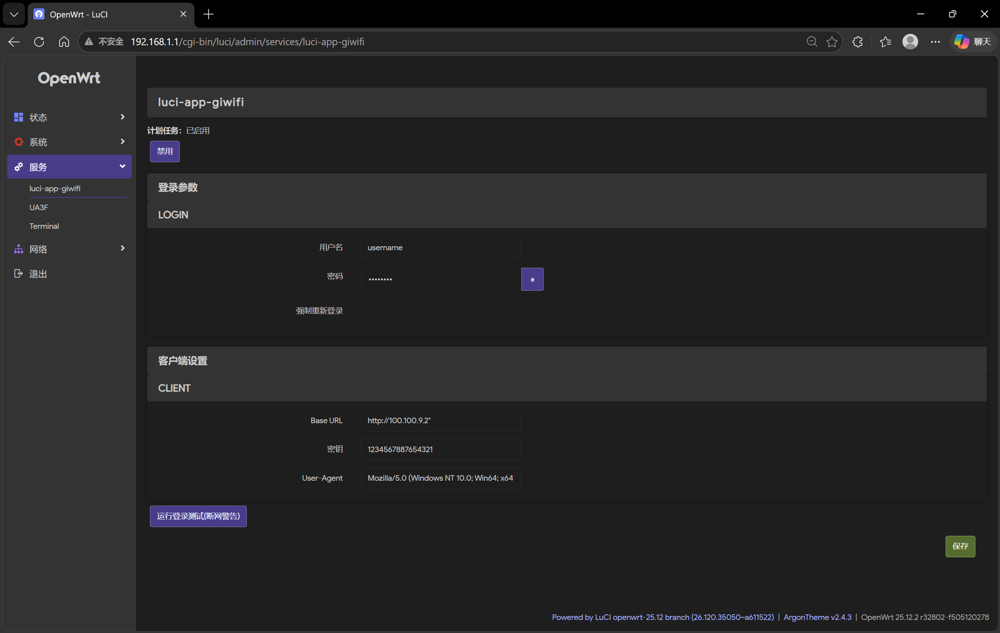

# openwrt 25
```sh
apk add --allow-untrusted $APK_NAME
```



```
Usage: giwifi [OPTIONS] [COMMAND]

Commands:
  login   登录
  logout  退出登录
  help    Print this message or the help of the given subcommand(s)

Options:
  -c, --config <CONFIG>  JSON 配置文件 [default: /etc/config/luci-app-giwifi.json]
  -b, --base <BASE>      认证网页IP
      --key <KEY>        AES-CBC 加密密钥
      --ua <UA>          User-Agent
  -h, --help             Print help
```

